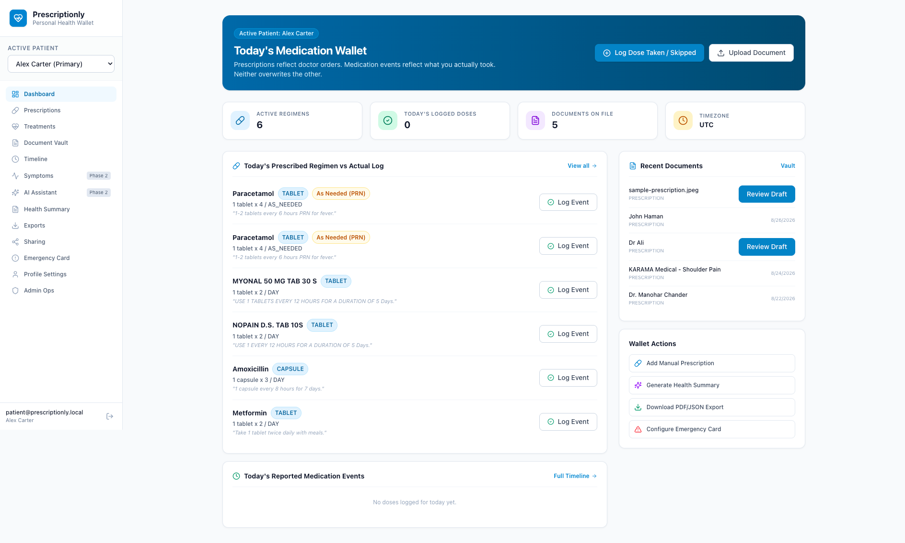
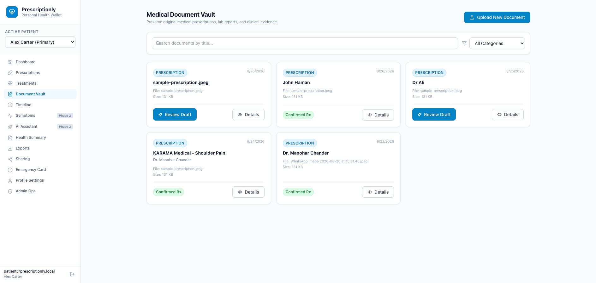
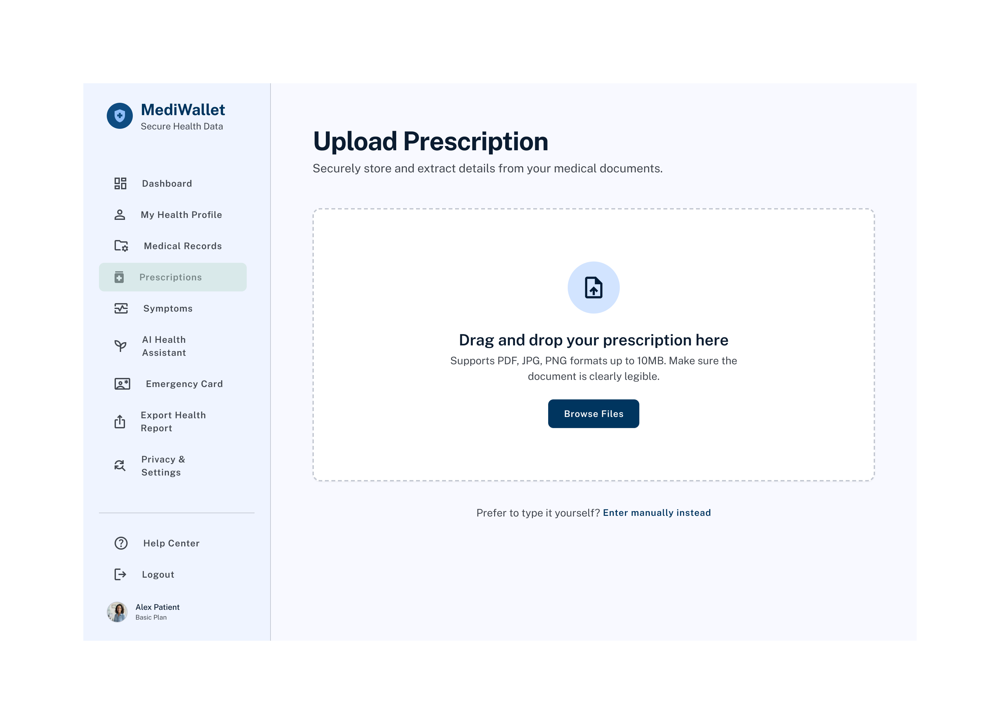

# Prescriptionly


Prescriptionly is a personal medical wallet for storing prescriptions and medical documents, organizing medication history, and recording what was actually taken over time.

The application keeps the original prescription separate from the patient's medication activity. A prescription remains an unchanged record of what was prescribed, while medication events record what the patient reports taking, skipping, applying, or receiving.

## Demo

[](https://youtu.be/5l-dwbP_aP4)

[Watch the 4-minute product walkthrough on YouTube](https://youtu.be/5l-dwbP_aP4)



## Features

- Store prescriptions and medical documents as PDF, JPG, or PNG files.
- Add prescriptions manually or review extracted details before saving them.
- Track prescriptions, treatment courses, schedules, and patient-reported medication events separately.
- Record over-the-counter medicines, supplements, injections, and other standalone medication activity.
- Browse a chronological timeline of documents, prescriptions, treatments, and medication events.
- Generate summaries and export records as PDF or structured JSON.
- Share selected information through temporary links or a limited emergency card.
- Manage more than one patient profile from the same account.

## Screenshots

| Medical records | Prescription details |
|---|---|
|  |  |

## Technology Stack

### Frontend

- React 19
- React Router
- Vite
- TypeScript
- Tailwind CSS
- Lucide icons

### Backend

- Node.js
- Express
- TypeScript
- Zod
- Prisma ORM
- MySQL

### Supporting Services

- Private local file storage adapter
- Database-backed background job queue
- PDFKit for PDF exports
- Docker Compose for local MySQL

## Project Structure

```text
.
├── apps/
│   ├── api/                  Express API, worker, Prisma schema and migrations
│   └── web/                  React and Vite frontend
├── docs/                     Product documentation and design references
├── compose.yml               Local MySQL service
├── .env.example              Example environment configuration
└── package.json              npm workspace scripts
```

## Getting Started

### Prerequisites

- Node.js 20 or later
- npm 10 or later
- Docker with Docker Compose, or an existing MySQL 8 or later instance

### Installation

1. Clone the repository:

   ```bash
   git clone https://github.com/Prescriptionly/app.git
   cd app
   ```

2. Install dependencies:

   ```bash
   npm ci
   ```

3. Create the local environment file:

   ```bash
   cp .env.example .env
   ```

4. Start MySQL:

   ```bash
   docker compose up -d
   ```

   If you are using an existing MySQL server, update `DATABASE_URL` in `.env` instead.

5. Generate the Prisma client, run migrations, and seed the database:

   ```bash
   npm run db:generate
   npm run db:migrate
   npm run db:seed
   ```

6. Start the API and web application:

   ```bash
   npm run dev
   ```

7. Start the background worker in another terminal:

   ```bash
   npm run worker --workspace=apps/api
   ```

Open [http://localhost:5173](http://localhost:5173) in your browser. The API runs on [http://localhost:4000](http://localhost:4000).

## Demo Account

Running the database seed creates the following local account:

```text
Email: patient@prescriptionly.local
Password: Password123!
```

This account is intended for local development only.

## Environment Configuration

The default development values are documented in `.env.example`.

| Variable | Description |
|---|---|
| `PORT` | API server port |
| `APP_URL` | Frontend URL allowed to access the API |
| `DATABASE_URL` | MySQL connection string |
| `SESSION_SECRET` | Secret used to protect application sessions |
| `COOKIE_SECURE` | Enables secure cookies when using HTTPS |
| `COOKIE_SAME_SITE` | SameSite policy for session cookies |
| `STORAGE_LOCAL_DIR` | Local directory used for uploaded documents |
| `MAX_FILE_SIZE_BYTES` | Maximum accepted upload size |

Replace the example session secret and database credentials before using a shared or deployed environment.

## Available Scripts

| Command | Description |
|---|---|
| `npm run dev` | Starts the API and frontend development servers |
| `npm run worker --workspace=apps/api` | Starts the background job worker |
| `npm run build` | Builds all workspaces |
| `npm run lint` | Runs ESLint across all workspaces |
| `npm run typecheck` | Runs TypeScript checks across all workspaces |
| `npm run test` | Runs the backend invariant test suite |
| `npm run db:generate` | Generates the Prisma client |
| `npm run db:migrate` | Applies development database migrations |
| `npm run db:seed` | Seeds the medication catalog and demo account |
| `npm run db:studio` | Opens Prisma Studio |

## Development Checks

Run the following commands before submitting changes:

```bash
npm run lint
npm run typecheck
npm run build
npm run test
```

## Medical Disclaimer

Prescriptionly is a record-keeping application and does not provide medical advice, diagnosis, treatment recommendations, or emergency services. Always consult a qualified healthcare professional regarding medical decisions.
