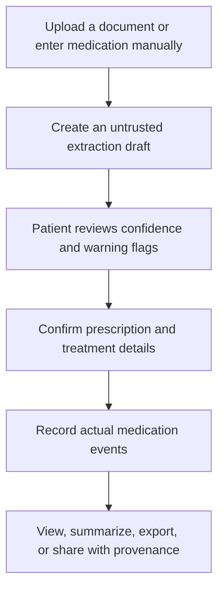
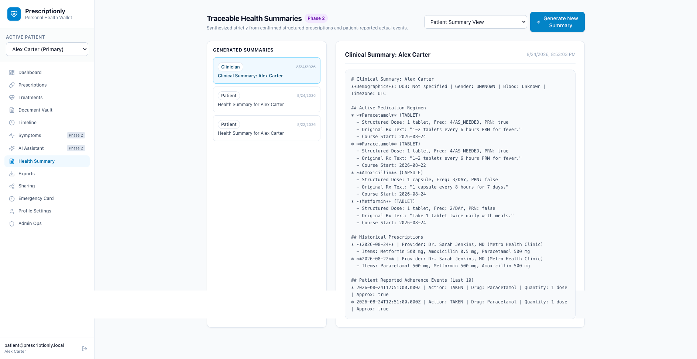
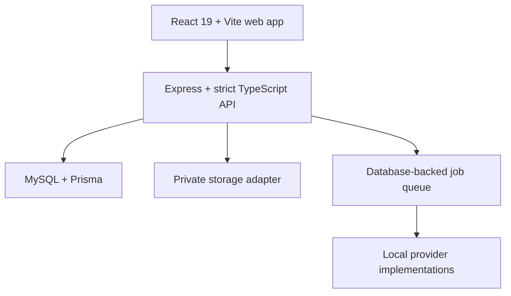

# Prescriptionly

**A patient-controlled medical wallet that keeps what was prescribed separate from what actually happened.**

[](https://hack-for-humanity-summer-26.devpost.com/)


Prescriptionly is a health-record and medication-history prototype built for [Hack for Humanity Summer 2026](https://hack-for-humanity-summer-26.devpost.com/). It helps a person preserve prescriptions and medical documents, review extracted medication details, record the medication they actually took, and share a traceable summary without rewriting the original clinical evidence.

> **A prescription is historical evidence. A medication event is the patient's reported reality. Prescriptionly preserves both.**


## The problem

Medication history is often fragmented across paper prescriptions, photos, PDFs, medicine boxes, different doctors, and a patient's memory. A prescription records what a clinician intended, but it does not prove when treatment started, whether a dose was taken, or whether the patient stopped early.

When these two stories are mixed together, important context can be lost:

- A prescription may remain unchanged even when the patient starts days later.
- A patient may take a partial, delayed, or skipped dose.
- Over-the-counter medicines and supplements may have no prescription at all.
- OCR can misread a critical decimal such as `0.5 mg` as `5 mg`.
- A new doctor may receive an incomplete history with no clear source or confidence level.

## The solution

Prescriptionly creates a patient-controlled chain from source evidence to reported reality:



The original document stays intact. Extracted fields remain drafts until confirmed. Expected doses and reminders never become proof that medication was taken. Corrections remain distinguishable from the original evidence.

## What makes Prescriptionly different

| Information layer | What it means | How Prescriptionly treats it |
|---|---|---|
| Original document | The source image or PDF | Preserved as evidence |
| OCR or AI extraction | A machine-generated interpretation | Untrusted draft with confidence and warnings |
| Confirmed prescription | Patient-reviewed structured instructions | Linked back to its source |
| Treatment course | When the patient reports starting, pausing, or stopping | Separate from the prescription |
| Expected dose | A schedule-generated occurrence | Never treated as an actual dose |
| Medication event | Taken, administered, applied, skipped, or partial | Patient-reported reality with its own timestamp |
| Summary or comparison | A system-generated view | Clearly derived and traceable |

This separation is the foundation of the data model, APIs, interface, timeline, exports, sharing, and audit history.

## Hackathon prototype

The current repository implements end-to-end prototype workflows for:

- **Secure access and patient profiles**: registration, sign-in, opaque sessions, CSRF protection, multi-profile support, and patient-level authorization.
- **Private medical document vault**: PDF and image uploads, document versions, MIME validation, SHA-256 deduplication, and private download controls.
- **Review-first extraction**: draft prescription extraction, field-level confidence, decimal-ambiguity warnings, editing, and explicit confirmation.
- **Prescription and treatment history**: multi-item prescriptions, original instruction text, structured dosage, custom medication names, treatment lifecycle, and flexible schedules.
- **Prescribed vs actual tracking**: expected doses remain separate from patient-reported taken, administered, applied, skipped, partial, or standalone OTC events.
- **Source-aware timeline**: doctor-prescribed, patient-reported, extraction-draft, and system-generated records remain visually distinguishable.
- **Patient-controlled portability**: patient and clinician summaries, PDF export, canonical Prescriptionly JSON export, category-scoped share links, and a deliberately limited emergency card.
- **Phase 2 explorations**: symptoms, a document-grounded assistant, reminders, privacy controls, background jobs, and privacy-preserving operational tools.

## Responsible AI and health-data safety

Prescriptionly is designed so that AI can assist without becoming the authority over a person's medication record.

- OCR and assistant output cannot silently become confirmed medical data.
- High-risk fields carry field-level confidence and visible warning flags.
- The review flow explicitly highlights decimal and frequency ambiguity.
- The assistant separates `FROM_DOCUMENT`, `AI_EXPLANATION`, and `NOT_PRESENT` responses.
- “Not present in this document” is never presented as “the patient does not have this condition.”
- Manual entry and core tracking continue without an external AI provider.
- The application does not diagnose, recommend treatment, approve medication behavior, or infer causation.

For a reproducible and private hackathon demo, the current build uses deterministic local mock/rule-based extraction and assistant behavior. It does not send uploaded health documents to an external model. Production-grade OCR or model integration, clinical validation, and provider-specific privacy review remain future work.

## Design previews

These screens show the product direction used to guide the current React interface.

| Medical records | Prescription details |
|---|---|
|  |  |

| Dashboard | Document assistant |
|---|---|
|  |  |

## Architecture

Prescriptionly is a domain-oriented modular monolith. This keeps the prototype easy to run while preserving clear boundaries around health data, providers, and asynchronous work.



### Technology stack

- **Frontend:** React 19, React Router, Vite, strict TypeScript, Tailwind CSS, Lucide icons
- **Backend:** Node.js, Express, strict TypeScript, Zod validation
- **Data:** MySQL, Prisma ORM, versioned migrations
- **Security:** Argon2 password hashing, opaque server-managed sessions, CSRF protection, ownership checks
- **Documents:** private local-development storage adapter, file validation, SHA-256 deduplication
- **Background work:** database-backed queue with leasing, idempotency, retries, and exponential backoff
- **Exports:** PDFKit and canonical JSON

## Run locally

### Prerequisites

- Node.js 20 or later
- npm 10 or later
- Docker with Docker Compose, or an existing MySQL 8+ instance

### 1. Install and configure

```bash
git clone https://github.com/Prescriptionly/app.git
cd app
npm ci
cp .env.example .env
```

The example environment is for local development only. Replace the session secret and database credentials before any shared or deployed environment.

### 2. Start MySQL

```bash
docker compose up -d
```

If you use a separate MySQL instance, update `DATABASE_URL` in `.env`.

### 3. Prepare the database

```bash
npm run db:generate
npm run db:migrate
npm run db:seed
```

### 4. Start the application

Terminal 1:

```bash
npm run dev
```

Terminal 2:

```bash
npm run worker --workspace=apps/api
```

Open [http://localhost:5173](http://localhost:5173). The API runs on [http://localhost:4000](http://localhost:4000).

### Local demo account

The seed command creates a fictional local account:

```text
Email: patient@prescriptionly.local
Password: Password123!
```

Never use these credentials in a deployed environment.

## Quality checks

```bash
npm run lint
npm run typecheck
npm run build
npm run test
```

The project intentionally uses no frontend unit-test suite. Frontend validation relies on strict TypeScript, linting, production builds, and focused browser smoke testing. The compact backend test suite targets high-risk invariants such as account isolation, unconfirmed extraction safety, prescribed-versus-actual separation, sharing scope, and queue idempotency.

## Repository structure

```text
.
├── apps/
│   ├── api/                  Express API, worker, Prisma schema, migrations
│   └── web/                  React and Vite application
├── docs/
│   ├── automation/           Build progress and verification ledger
│   ├── modules/              Product module specifications
│   ├── raw-idea/             Product vision
│   └── raw-ui/               Design references
├── compose.yml               Local MySQL service
├── .env.example              Documented local configuration
└── package.json              npm workspace commands
```

## Current limitations

Prescriptionly is a hackathon prototype, not a production healthcare system or medical device.

- OCR and assistant behavior currently use deterministic local demo implementations and have not been validated on real-world handwriting or clinical documents.
- Export currently supports a human-readable PDF and canonical Prescriptionly JSON. FHIR and country-specific adapters are roadmap items, not current compatibility claims.
- A generated export does not guarantee that a hospital or electronic health-record system can import it.
- Local disk storage is suitable for development only. Production use requires hardened private object storage, encryption and key management, backups, monitoring, and incident response.
- Security controls require independent review and deployment hardening before handling real patient data.
- The project makes no HIPAA, GDPR, regional compliance, diagnostic, treatment, or medical-device certification claim.

## Roadmap

- Validate the core prescribed-versus-actual workflow through patient and clinician research.
- Integrate a real OCR provider behind an explicit consent and data-processing boundary.
- Add multilingual extraction and non-Latin medication-name support.
- Build and validate versioned FHIR adapters without reshaping the canonical internal model around one external standard.
- Improve accessibility, mobile capture, offline resilience, and dependent-care workflows.
- Complete threat modeling, privacy review, clinical safety review, and production infrastructure hardening.

## Hackathon

Prescriptionly was created for [Hack for Humanity Summer 2026](https://hack-for-humanity-summer-26.devpost.com/), a month-long event focused on software that improves mental or physical well-being.

The project addresses physical well-being by helping people build a more faithful medication history, preserve the evidence behind it, and carry that history across doctors, healthcare providers, and future systems. Its primary innovation is not another reminder app. It is a provenance-first model that refuses to confuse medical instructions with patient-reported reality.

## Medical disclaimer

Prescriptionly is an informational record-keeping prototype. It does not provide medical advice, diagnosis, treatment recommendations, emergency services, or a substitute for a qualified healthcare professional. Do not use the prototype with real medical data in an unreviewed local or public deployment.
